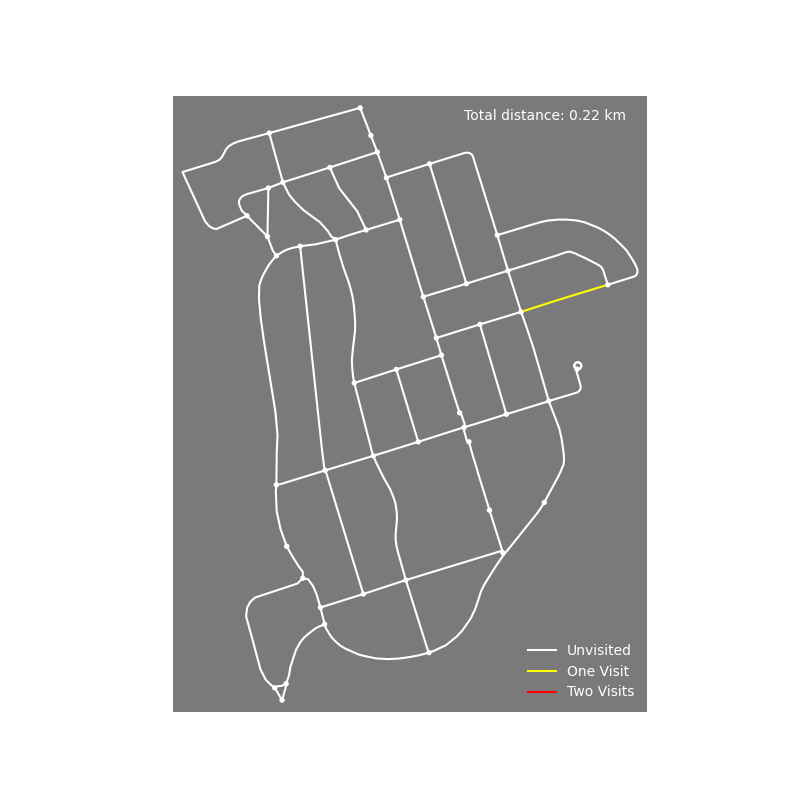

# shippaniltonian
Solving the Chinese Postman Problem for Shippan. Repository for [this blog post](https://jschless.github.io/posts/chinese-postman-problem-irl/). 

Takes a map from openstreetmap, computes the shortest eulerian circuit for it, and makes a little animation of the most efficient path.

